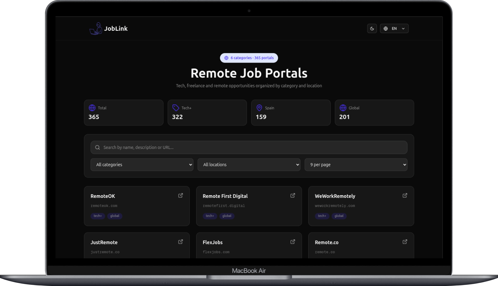
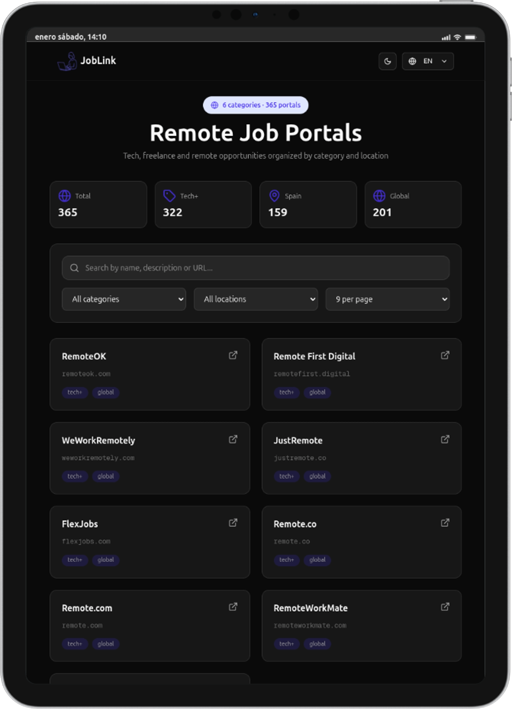
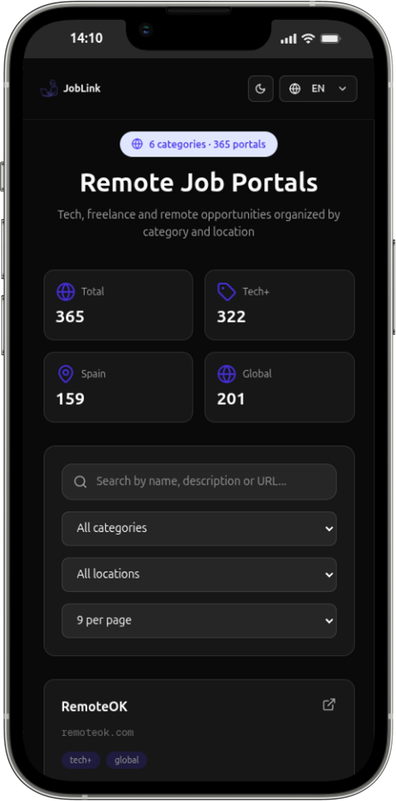

# JobLink

📘 También disponible en [inglés](./README.md)

> 🚀 **Compartiendo recursos para la comunidad tech**

Este proyecto nació de la necesidad de ayudar a desarrolladores, diseñadores y profesionales del sector tecnológico como yo a encontrar oportunidades laborales y comprender mejor el mercado actual.

[](https://job-link-gray.vercel.app/)
[](https://nextjs.org/)
[](https://tailwindcss.com/)

---

## 🎯 ¿Qué encontrarás aquí?

- 🔗 **Portales de empleo** para puestos tecnológicos, creativos y digitales
- 📊 **Recursos actualizados** sobre el mercado laboral
- 🌍 Oportunidades **remotas y presenciales**

## 🚀 Demo

Visita [JobLink](https://job-link-gray.vercel.app/) para ver el proyecto en vivo.

## 🎬 Video Demo

Mira la demo del proyecto [JobLink](https://youtu.be/wiZI81njLYU?si=1QQuk1IeEfLAjAma)

## 📱 Capturas de pantalla

### Escritorio



### Tablet



### Móvil



## ✨ Características

- 📱 **Diseño responsive**: Optimizado para móvil, tablet y escritorio.
- 🌙 **Modo oscuro / claro**: Cambia entre temas según tu preferencia.
- ⚡ **Rendimiento**: Carga rápida con Next.js 16.
- 🎨 **UI**: Diseñada con Tailwind CSS 4.
- ♿ **Accesible**: Etiquetas de accesibilidad web.

## 🛠️ Stack tecnológico

- **Framework**: [Next.js](https://nextjs.org/) 16
- **Estilos**: [Tailwind CSS](https://tailwindcss.com/) 4
- **Componentes UI**: [Shadcn/ui](https://ui.shadcn.com/)
- **Deploy**: [Vercel](https://vercel.com/)
- **Datos**: JSON

## 📦 Instalación


    # Clonar el repositorio
    git clone https://github.com/nuriadevs/job-link.git
    
    # Navegar al directorio
    cd job-link
    
    # Instalar dependencias
    pnpm install
    
    # Ejecutar en modo desarrollo
    pnpm dev
    
    # Abrir http://localhost:3000 en el navegador

 ## 🔄 Actualizaciones

Actualizo este proyecto regularmente con mejoras en los enlaces, nuevas funcionalidades o ajustes en la interfaz.

## 🌱 ¿Quieres contribuir?

### 📝 ¿Cómo añadir una nueva plataforma?

En el archivo JSON, los sitios siguen esta estructura:

```json
{
"id": 1,
"name": "Website name",
"url": "https://example.com",
"category": ["freelance", "tech", "creative"],
"location": "global/spain/specific",
"description": "Brief description"
}
```

-   📝 **Abre una issue** para sugerir mejoras
    
-   🔧 **Envía una PR** con nuevas funcionalidades
    
-   📢 **Comparte** el proyecto en redes sociales
    

## 🔗 Fuentes de URLs

Las URLs se recopilaron a partir de:

-   Mi propia búsqueda manual de fuentes relevantes.
    
-   El repositorio [remote-es/remotes](https://github.com/remote-es/remotes), que recopila recursos y enlaces útiles para encontrar trabajo remoto en español.
    

## 🤝 Contacto

Si tienes preguntas, sugerencias o simplemente quieres charlar sobre el proyecto, envíame un mensaje.

----------

**Hecho con ❤️ para la comunidad tech**

_Si este recurso te ayuda a encontrar tu próxima oportunidad, ha cumplido su objetivo._

----------

⭐ **¿Te gustó el proyecto? ¡Dale una estrella!** ⭐